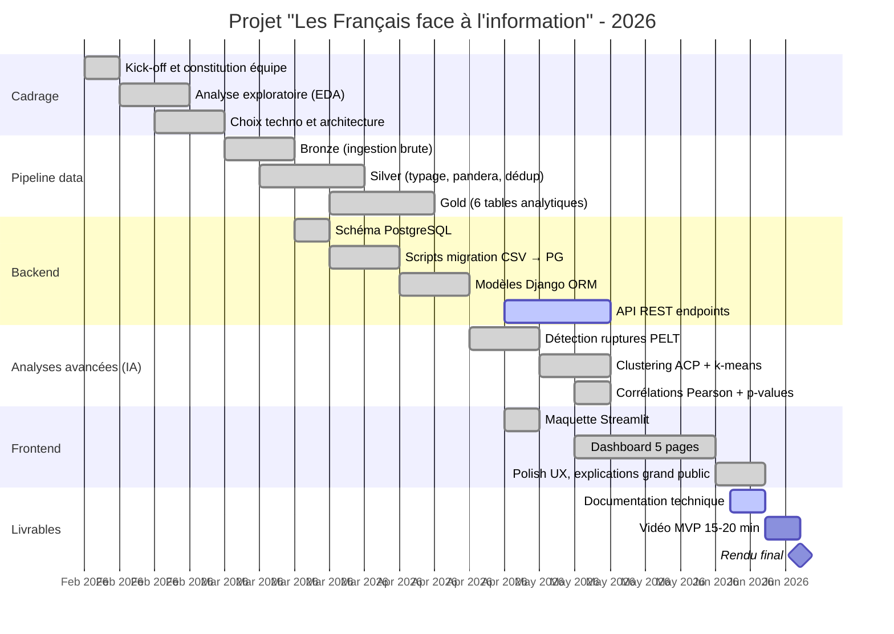

# Planning et méthodologie

## Vue d'ensemble

- **Période projet** : février 2026 → juin 2026 (5 mois)
- **Effectif** : 3 personnes
- **Méthodologie** : Agile hybride, sprints d'environ 2 semaines, points synchros 2×/semaine sur Teams/Discord
- **Versioning** : Git + GitHub, branche `main` protégée, PR systématique
- **Suivi des tâches** : tableau Kanban informel + synthèses écrites à chaque jalon
- **Communication** : Teams pour le quotidien, Discord pour les sessions de pair-programming

## Timeline détaillée

## Phases et jalons

### Phase 1 — Cadrage (février 2026)
- ✅ Lecture du cahier des charges Open Data University
- ✅ EDA sur les CSV INA : 268 K lignes JT, 14 thèmes, 5 chaînes
- ✅ Détection des problèmes qualité (encodage latin-1, ~1 % de valeurs manquantes)
- ✅ Choix d'architecture : pipeline médaillon Bronze/Silver/Gold
- ✅ Choix de la stack : Python/pandas, pandera, Streamlit, PostgreSQL, scikit-learn

### Phase 2 — Pipeline data (mars 2026)
- ✅ Bronze : ingestion brute + génération de rapports qualité automatiques
- ✅ Silver : typage strict, validation pandera, déduplication tracée, enrichissement (année, mois, jour de la semaine)
- ✅ Gold : 6 tables agrégées prêtes pour la visualisation et le ML

### Phase 3 — Backend (avril 2026)
- ✅ Schéma PostgreSQL 3NF : `channels`, `themes`, `daily_stats`, `yearly_gender`, `hourly_stats`
- ✅ Scripts de migration CSV → PostgreSQL (batch de 1000 lignes)
- ✅ Modèles Django ORM avec validators et managers personnalisés
- 🔄 API REST en cours

### Phase 4 — Analyses avancées (avril–mai 2026)
- ✅ Détection de ruptures temporelles avec l'algorithme PELT (`ruptures`)
- ✅ Clustering non supervisé : ACP (réduction de dimension) + k-means (3 archétypes de chaînes identifiés)
- ✅ Matrice de corrélations Pearson thèmes × parité avec test de significativité

### Phase 5 — Frontend (mai–juin 2026)
- ✅ Maquette Streamlit
- ✅ Dashboard 5 pages : Accueil, Agenda médiatique, Parité H/F, Thèmes × Parité, Analyses avancées
- ✅ Polish UX : explications dépliables grand public, palette cohérente, accessibilité

### Phase 6 — Livrables (juin 2026)
- 🔄 Document technique groupe + 3 individuels
- 🔄 Vidéo MVP 15-20 min
- 🔄 Rendu final

## Backlog (cumulé par phase)

### Done ✅
- [x] EDA initial sur les 7 datasets
- [x] Choix architecture médaillon
- [x] Pipeline Bronze (lecture + qualité)
- [x] Pipeline Silver (typage + pandera + déduplication)
- [x] Pipeline Gold (6 tables analytiques)
- [x] Schéma PostgreSQL
- [x] Scripts migration
- [x] Modèles Django
- [x] Détection ruptures PELT (5 rubriques)
- [x] Clustering ACP + k-means (3 clusters)
- [x] Corrélations Pearson avec p-values
- [x] Dashboard Streamlit 5 pages
- [x] Sélecteur de période + presets
- [x] Explications grand public (12 graphes documentés)
- [x] Style cohérent (template Plotly custom + palette unifiée)

### Doing 🔄
- [ ] Documentation technique groupe (PDF)
- [ ] Documents individuels (3 × PDF)
- [ ] Script + tournage vidéo MVP

### Backlog (optionnel selon temps)
- [ ] API REST Django opérationnelle
- [ ] Containerisation Docker
- [ ] Déploiement cloud (Streamlit Community Cloud / Railway / Render)
- [ ] Publication réutilisation sur data.gouv.fr
- [ ] Bonus inaSpeechSegmenter (analyse audio CNN)

## Rôles dans l'équipe

| Membre | Rôle principal | Responsabilités |
|---|---|---|
| **Lucas** *(Lu6asM)* | Data / Frontend | EDA initial, pipeline Silver/Gold, analyses avancées, dashboard Streamlit |
| **Baptiste** | Lead Backend | Schéma PostgreSQL, modèles Django, scripts migration, API REST |
| **Gérard** | Data / QA | Pipeline Bronze, validation pandera, tests, documentation |

Les trois membres collaborent transversalement : la doc est relue par tous, les choix d'architecture sont validés collégialement, le pair-programming est encouragé sur les phases sensibles (migration BDD, dashboard).

## Méthodologie agile appliquée

- **Sprints** de 2 semaines, démos courtes en fin de sprint
- **Rétrospective** rapide après chaque livraison majeure (Bronze, Silver, Gold, MVP dashboard)
- **Code review** : chaque PR relue par au moins un autre membre
- **Conventions de commit** : préfixes type `feat:`, `fix:`, `docs:`, `refactor:`
- **Branches** : `main` protégée, `feat/xxx` pour les développements, merge via PR

## Gestion des risques (matrice)

| Risque | Probabilité | Impact | Mitigation |
|---|---|---|---|
| Pipeline pandera bloque sur données réelles | Moyenne | Moyen | Validation incrémentale, rapports qualité Bronze |
| Streamlit Cloud quotas dépassés en démo | Faible | Faible | Cache `st.cache_data`, repli vers démo locale |
| Backend Django pas prêt à temps | Élevée | Moyen | Dashboard Streamlit autonome, BDD = bonus |
| Vidéo dépasse 20 min ou son médiocre | Moyenne | Élevé | Répétitions, OBS Studio + micro USB, montage post |
| Conflit Git sur branche commune | Faible | Faible | PR systématique, communication Teams |
| Données absentes pour la radio thématique | Élevée | Faible | Périmètre TV-only pour l'analyse thématique, radio sur parité uniquement |

## Suivi du temps (estimations)

| Phase | Estimé | Réel |
|---|---|---|
| Cadrage + EDA | 3 semaines | 3 semaines |
| Pipeline data | 4 semaines | 4 semaines |
| Backend (partiel) | 4 semaines | 4 semaines |
| Analyses avancées | 4 semaines | 3 semaines |
| Frontend dashboard | 6 semaines | 5 semaines |
| Livrables (docs + vidéo) | 2 semaines | en cours |
| **Total** | **~22 semaines** | **~20 semaines** |
