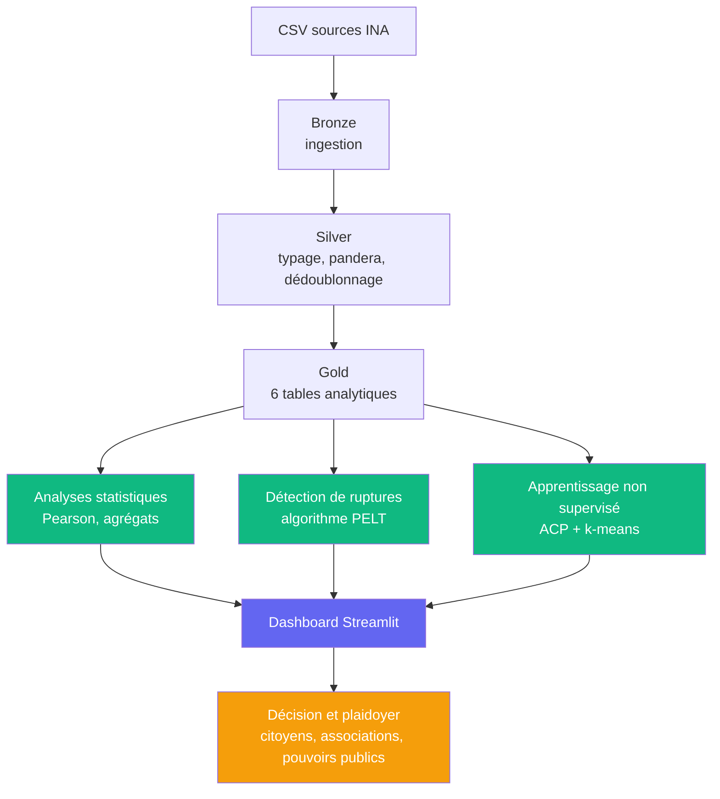
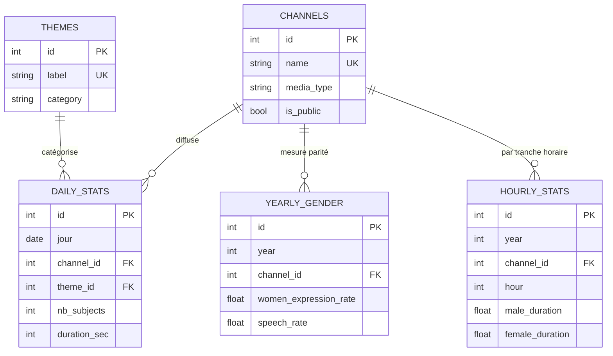
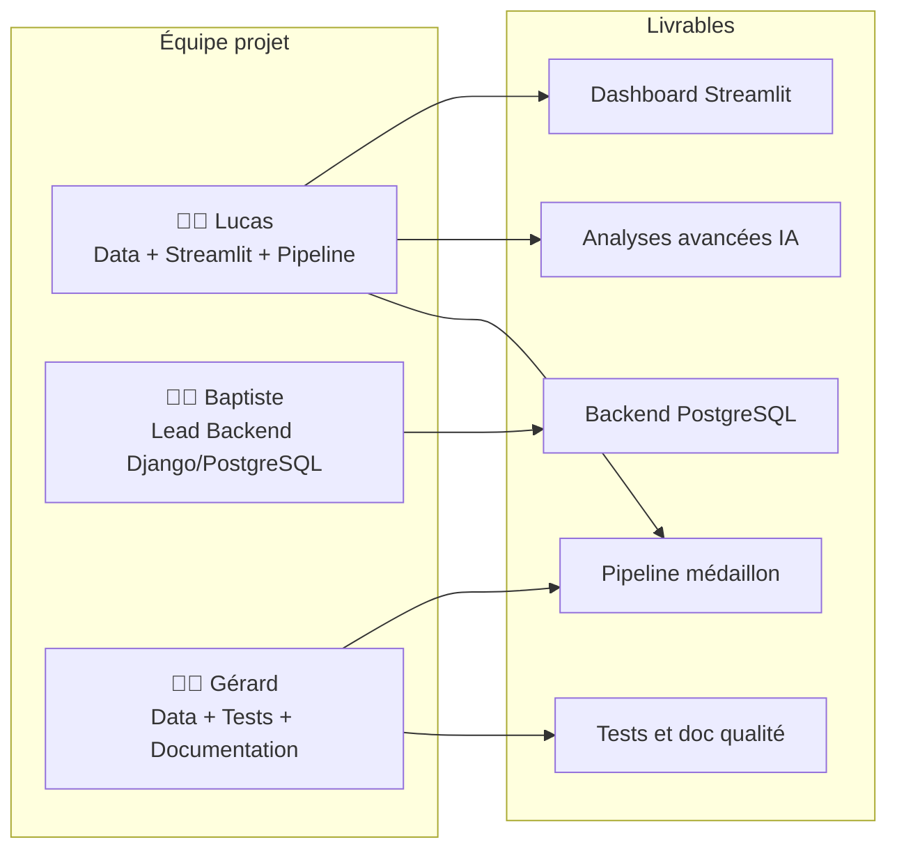
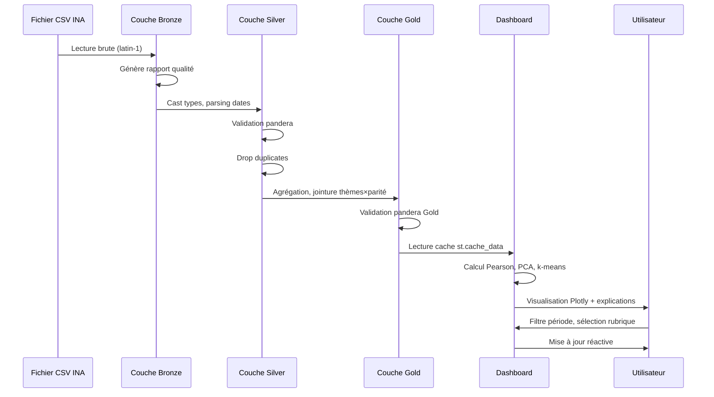
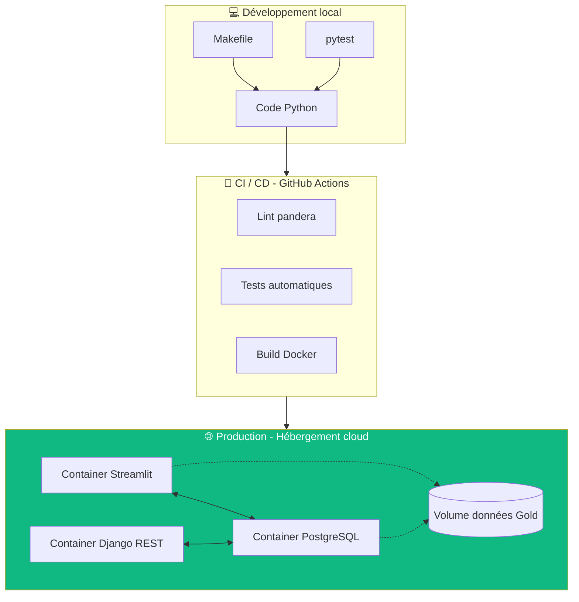

# Diagrammes du projet

À insérer dans le rendu groupe et dans la vidéo (screenshots).
Les diagrammes Mermaid se rendent nativement sur GitHub, dans VS Code (extension Markdown Preview Mermaid), et dans Pandoc avec `mermaid-filter`.

---

## 1. Architecture médaillon Bronze → Silver → Gold

```mermaid
flowchart LR
    subgraph SOURCES["📦 Sources INA (Open Data)"]
        S1[ina-barometre-jt<br/>thèmes JT quotidiens]
        S2[20190308-stats<br/>parole H/F par chaîne]
        S3[20190308-years<br/>agrégats annuels]
        S4[20190308-hourstatall<br/>stats horaires]
        S5[20190308-radio-years<br/>parité radio]
        S6[20190308-tv-years<br/>parité TV]
        S7[evenements_france<br/>référentiel manuel]
    end

    subgraph BRONZE["🥉 BRONZE - Ingestion brute"]
        B1[Lecture CSV<br/>encodage latin-1]
        B2[Rapport qualité<br/>nulls, dupes, types]
    end

    subgraph SILVER["🥈 SILVER - Nettoyage et typage"]
        SI1[Cast types,<br/>parsing dates]
        SI2[Validation pandera]
        SI3[Suppression doublons]
        SI4[Enrichissement<br/>annee, mois, jour_semaine]
    end

    subgraph GOLD["🥇 GOLD - 6 tables analytiques"]
        G1[tv_theme_parite]
        G2[parite_unifiee]
        G3[stats_prime_time]
        G4[themes_evenements]
        G5[saisonnalite]
        G6[parite_ranking]
    end

    subgraph CONSO["🎯 Consommation"]
        D1[Streamlit dashboard]
        D2[PostgreSQL + Django<br/>API REST]
        D3[Analyses avancées<br/>ruptures / clustering / corrélations]
    end

    SOURCES --> BRONZE --> SILVER --> GOLD --> CONSO

    style BRONZE fill:#cd7f32,color:#fff
    style SILVER fill:#c0c0c0,color:#000
    style GOLD fill:#ffd700,color:#000
    style CONSO fill:#6366f1,color:#fff
```

---

## 2. Pipeline data → IA → décision

---

## 3. Schéma relationnel PostgreSQL

---

## 4. Organisation de l'équipe

---

## 5. Cycle de vie d'une donnée (exemple)

---

## 6. Architecture de déploiement (cible)

